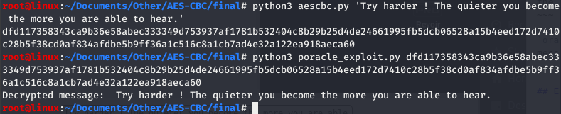
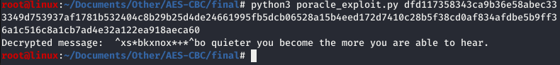
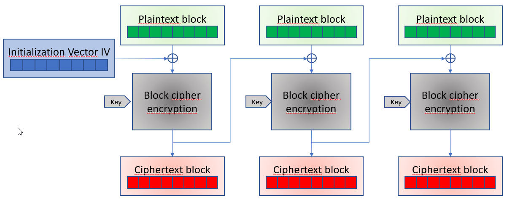
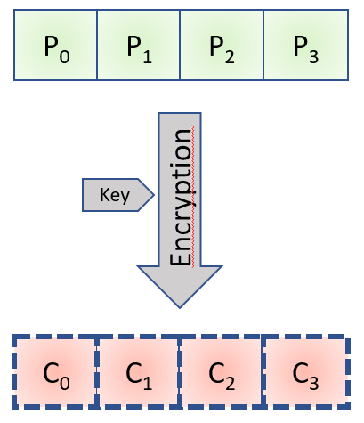
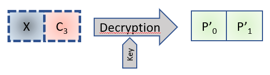

# Padding Oracle Attack Explained
_**Padding Oracle attack fully explained and coded from scratch in Python3.**_

### Summary  

[1- Overview](https://github.com/flast101/padding-oracle-attack-explained#1--overview)   
[2- Script Usage](https://github.com/flast101/padding-oracle-attack-explained#2--script-usage)    
[3- AES-CBC Ciphering](https://github.com/flast101/padding-oracle-attack-explained#3--aes-cbc-ciphering)    
[4- Exploiting CBC mode](https://github.com/flast101/padding-oracle-attack-explained#4--exploiting-cbc-mode)    
[5- Padding Oracle Attack](https://github.com/flast101/padding-oracle-attack-explained#5--padding-oracle-attack)    
[6- Python3 Script](https://github.com/flast101/padding-oracle-attack-explained#6--python3-script)

* * *
## 1- Overview

The padding oracle attack is a spectacular attack because it allows to decrypt a message that has been intercepted if the message was encrypted using CBC mode. POODLE (Padding Oracle On Downgraded Legacy Encryption) is a man-in-the-middle exploit which takes advantage of Internet and security software clients' fallback to SSL 3.0. If attackers successfully exploit this vulnerability, on average, they only need to make 256 SSL 3.0 requests to reveal one byte of encrypted messages.   
It will only require ensuring that we are able to obtain a response from the server that will serve as an Oracle (we'll come back to these in more detail later in this report). We will then be able to decrypt the entire message except the first block, unless we know the initialization vector.   

You can find more informtions on [Padding Oracle Attack](https://en.wikipedia.org/wiki/Padding_oracle_attack) and [POODLE](https://en.wikipedia.org/wiki/POODLE).

In this article, we will focus on how to use this vulnerability and propose a python script that exploits CBC mode to decrypt a message encrypted in AES-CBC.

* * *
## 2- Script Usage

If you're only insterested in using the code, the chapter 2 is all you need. However, please note you won't be able to decrypt the first block if you don't know the initialization vector.

[Download](https://github.com/flast101/padding-oracle-attack-explained/archive/master.zip) to get the script or **`$ git clone https://github.com/flast101/padding-oracle-attack-explained.git`**   

Cryptographic parameters (block size, initialization vector IV, and key) can be modified in **`settings.py`**. Particularly, you can enter the initialization vector (IV) if you know it. If you don't, enter any value (the length must be the same as a block), e.g. '\x00\x00\x00\x00\x00\x00\x00\x00\x00\x00\x00\x00\x00\x00\x00\x00'.

Encyption and decryption using AES-CBC algorithm with **`aescbc.py`**:
~~~
$ python3 aescbc.py <message>          encrypts and displays the message (output in hex format)
$ python3 aescbc.py -d <hex code>      decrypts and displays the message
~~~

Decrypting a message using the padding oracle attack with **`poracle_exploit.py`**:
~~~
$ python3 poracle_exploit.py <message>         decrypts and displays the message
~~~

**`oracle.py`** is our oracle: a boolean function determining if the message is encrypted with valid PKCS7 padding .


## Example
If you know the IV, you will be able to decrypt the whole message:




In case you don't know the IV, you won't be able to decrypt the first block and you will get a result as follows:




* * * 
## 3- AES-CBC Encryption
### 3.1- Advanced Encryption Standard (AES)
Safeguarding information has become mandatory in today’s cybersecurity world. Encryption is one such method to protect discret information being transferred online.

The Advanced Encryption Standard (AES), is a specification for the encryption of electronic data established by the U.S. National Institute of Standards and Technology (NIST) in 2001.

The Encryption technique is employed in two ways, namely symmetric encryption and asymmetric encryption. For symmetric encryption, the same secret key is used for both encryption and decryption, while asymmetric encryption has one key for encryption and another one for decryption.

With regard to symmetric encryption, data can be encrypted in two ways. There are stream ciphers: any length of data can be encrypted, and the data does not need to be cut. The other way is block encryption. In this case, the data is cut into fixed size blocks before encryption.

There are several operating modes for block encryption, such as Cipher Block Chaining (CBC), as well as CFB, ECB... etc.


### 3.2- Cipher Block Chaining (CBC)

In CBC mode, each block of plaintext is XORed with the previous ciphertext block before being encrypted. This way, each ciphertext block depends on all plaintext blocks processed up to that point. To make each message unique, an initialization vector must be used in the first block. 

CBC has been the most commonly used mode of operation, e.g. in applications such as SSL or VPN like OpenVPN and IPsec. Its main drawbacks are that encryption is sequential (i.e., it cannot be parallelized), and that the message must be **padded** to a multiple of the cipher block size.



If the first block has the index 0, the mathematical formula for CBC encryption is:    
**C<sub>i</sub> = E<sub>K</sub> (P<sub>i</sub> ⊕ C<sub>i-1</sub>) for i ≥ 1,**     
**C<sub>0</sub> = E<sub>K</sub> (P<sub>0</sub> ⊕ IV)**

For decryption, we have:   
**P<sub>i</sub> = D<sub>K</sub>(C<sub>i</sub>) ⊕ C<sub>i-1</sub>**     

Where E<sub>K</sub> is the function of encryption with the key K, D<sub>K</sub> is the function of decryption with the key K, IV the initialization vector, and C<sub>0</sub> is the first crypted block.


Decrypting with the incorrect IV causes the first block of plaintext to be corrupt but subsequent plaintext blocks will be correct. This is because each block is XORed with the ciphertext of the previous block, not the plaintext, so one does not need to decrypt the previous block before using it as the IV for the decryption of the current one. This means that a plaintext block can be recovered from two adjacent blocks of ciphertext. 


* * *
## 4.- Exploiting CBC mode
### 4.1- PKCS7 Padding Validation Function

The padding mainly used in block ciphers is defined by [PKCS7](https://docs.deistercloud.com/content/Axional%20development%20libraries.20/Axional%20JS%20Script/AX%20Library.10/crypt/PKCS/PKCS7.xml?embedded=true) (Public-Key Cryptography Standards) whose operation is described in [RFC 5652](https://tools.ietf.org/html/rfc5652). If N is the number of bytes of a block and M bytes (M < N) are missing in the last block, then we will add the character **‘0xM’** M times at the end of the block. PKCS7 padding is also done this way.

When the block will be decrypted there will be a verification to check if the padding is good or wrong. If we can know when we have a bad or a good padding, e.g. the server sends back an "error padding" or "404 not found" message when the padding is wrong. We will call this our Oracle. 

Here, we want to write this function, a function which takes clear text in binary as input and which returns a boolean validating or invalidating the fact that this text is indeed a text with a PKCS7 padding.   
It determines whether the input data may or may not meet PKCS7 requirements. In our code, the function is named **`pkcs7_padding`**:

```python
def pkcs7_padding(data):
    pkcs7 = True
    last_byte_padding = data[-1]
    if(last_byte_padding < 1 or last_byte_padding > 16):
        pkcs7 = False
    else:
        for i in range(0,last_byte_padding):
            if(last_byte_padding != data[-1-i]):
                pkcs7 = False
    return pkcs7
```

### 4.2- Ask The Oracle   

Here, we want a function that determines whether an encrypted text corresponds to PKCS7 padding valid encrypted data. It simply calls our **`pkcs7_padding`** and apply it to the AES decryption of a message. It plays the role of the Oracle, which is the actual server receiving the message of the communication.
This Oracle function will be used a lots to exploit the CBC vulnerability.

Here is the script **`oracle.py`** using the oracle function:

```python
#!/usr/bin/env python3
import sys,os
from Crypto.Cipher import AES
from settings import *
mode = AES.MODE_CBC

# AES CBC decryption 
def decryption(encrypted):
    decryptor = AES.new(key, mode, IV=IV)
    return decryptor.decrypt(encrypted)

# Ckeck validity of PKCS7 padding
def pkcs7_padding(data):
    pkcs7 = True
    last_byte_padding = data[-1]
    if(last_byte_padding < 1 or last_byte_padding > 16):
        pkcs7 = False
    else:
        for i in range(0,last_byte_padding):
            if(last_byte_padding != data[-1-i]):
                pkcs7 = False
    return pkcs7

# Determine if the message is encrypted with valid PKCS7 padding
def oracle(encrypted):
    return pkcs7_padding(decryption(encrypted))
```

### 4.3- CBC Mode Vulnerability

Let's take a theoretical example, a character string which, when padded, is made of 4 blocks of 16 bytes each. The 4 plaintext blocks are P<sub>0</sub> to P<sub>3</sub> and the 4 encrypted blocks are C<sub>1</sub> to C<sub>3</sub>.

We can illustrate it with the following diagram:



We wrote this formula in the previous chapter:   
**C<sub>i</sub> = E<sub>K</sub> (P<sub>i</sub> ⊕ C<sub>i-1</sub>)**

If we apply decryption on both sides of the formula, we have:    
**D<sub>K</sub> ( C<sub>i</sub> ) = P<sub>i</sub> ⊕ C<sub>i-1</sub>**    

And as XOR is a commutative operation:
**P<sub>i</sub> = D<sub>K</sub> ( C<sub>i</sub> ) ⊕ C<sub>i-1</sub>** 
 


Now let's take a totally random new X block. It's a block that we create and that we that we can change. Let's take with it the last encrypted block from our example, C<sub>3</sub>, and concatenate them.

It gives the following Diagram:




Applying our maths to this diagram, we can write the 2 following formulas:

- C<sub>3</sub> = E<sub>K</sub> ( P<sub>3</sub> ⊕ C<sub>2</sub> )
- P'<sub>1</sub> = D<sub>K</sub> ( C<sub>3</sub> ) ⊕ X

Now, we can replace "C<sub>3</sub>" by "E<sub>K</sub> ( P<sub>3</sub> ⊕ C<sub>2</sub> )" in the second formula:   
P'<sub>1</sub> = P<sub>3</sub> ⊕ C<sub>2</sub> ⊕ X

As XOR operation is commutative, the following formula is also true:
**P<sub>3</sub> = P'<sub>1</sub> ⊕ C<sub>2</sub> ⊕ X**

We have something really interesting here because this fromula is the link between 2 known elements and 2 unknown elements.

**Known elements:**
- X: this is the element that we control, we can choose it.
- C<sub>2</sub>: this is the penultimate encrypted block.

**Unknown elements:**
- P<sub>3</sub>: the last plaintext block, which we are trying to find.
- P'<sub>1</sub>: the plaintext block coming from the concatenation of X and C<sub>3</sub>. We don't know it, but we will be able to discover it thanks to the padding mechanism.

The 2 key points to understand here are:
1. We know that the decryption of an encrypted text must be a plaintext with a valid padding, therefore ending with 0x01 or 0x02 0x02 etc, and so is P'<sub>1</sub>. We know each "end form" of P'<sub>1</sub> which satisfies this rule.      
2. We can make X vary until we find a X value in acordance with each "end form" of P'<sub>1</sub>.


**As a conclusion o this chapter, we can say that this equation has no cryptography anymore, only XOR. We could skip the cryptographic aspect only with maths.**

This is exactely where resides the vulnerability of CBC mode... and the beauty of this attack. Using maths, we have just demonstrated that we can get rid of cryptography if we know how PKCS7 padding works.

* * * 
## 5- Padding Oracle Attack

### 5.1- Last Byte

We just saw that    
**P<sub>3</sub> = P'<sub>1</sub> ⊕ C<sub>2</sub> ⊕ X**

This equality only contains the XOR operation. As you know, the XOR is a bit by bit operation, so we can split this equality by calculating it byte by byte.
As our blocks size is 16 bytes, we have the following equations:   
P<sub>3</sub>[0] = P'<sub>1</sub>[0] ⊕ C<sub>2</sub>[0] ⊕ X[0]   
P<sub>3</sub>[1] = P'<sub>1</sub>[1] ⊕ C<sub>2</sub>[1] ⊕ X[1]    
P<sub>3</sub>[2] = P'<sub>1</sub>[2] ⊕ C<sub>2</sub>[2] ⊕ X[2]  
(...)   
P<sub>3</sub>[14] = P'<sub>1</sub>[14] ⊕ C<sub>2</sub>[14] ⊕ X[14]   
P<sub>3</sub>[15] = P'<sub>1</sub>[15] ⊕ C<sub>2</sub>[15] ⊕ X[15]

We also know that the decryption of an encrypted text must be a plaintext with a valid padding, therefore ending with 0x01 or 0x02 0x02 etc.   
As we control all bytes of X, we can bruteforce the last byte (256 values between 0 and 255) until we obtain a valid padding for P'<sub>1</sub>, i.e. until the oracle function returns _"True"_ when its input is X + C<sub>3</sub> (concatenation of X and C<sub>3</sub>).     
**In this case, it will mean that the clear text padding of P’<sub>1</sub> ends with 0x01.**


Once we find the last byte of X which gives the valid padding, we know that the padding value P'<sub>1</sub>[15] = 0x01, which means:   
**P<sub>3</sub>[15] = P'<sub>1</sub>[15] ⊕ C<sub>2</sub>[15] ⊕ X[15] = 0x01 ⊕ C<sub>2</sub>[15] ⊕ X[15]**

With this information, we find the last byte of the last block of text plaintext.

### 5.2- What Else ?

Now, we will look for the value of the previous byte of P<sub>3</sub>, ie. P<sub>3</sub>[14] in our case.

We now have a padding of 0x02 0x02 (ie. '\x02\x02') on P’<sub>1</sub>, which results in P’<sub>1</sub>[15] = P’<sub>1</sub>[14] = 0x02. And by the way, our P<sub>3</sub>[15] is now known since we just found it.   

So this time we have the following:

- X[15] = P'<sub>1</sub>[15] ⊕ C<sub>2</sub>[15] ⊕ P<sub>3</sub>[15] = 0x02 ⊕ C<sub>2</sub>[​ 15​ ] ⊕ P<sub>3</sub>[15] where C<sub>2</sub>[15] et P<sub>3</sub>[15] are known
- P<sub>3</sub>[14] = P'<sub>1</sub>[14] ⊕ C<sub>2</sub>[14] ⊕ X[14] = ​ 0x02​ ⊕ C<sub></sub>[14] ⊕ X[14] 
 
It is therefore X[14] that we brute force, that is to say that we vary between 0 and 256 in hexa, with P'<sub>1</sub>[14] value of 0x02.

We have all the values in hand which allow us to find P<sub>3</sub>[14], and after this step we know the last 2 bytes of P<sub>3</sub>, which is what we are trying to find.

### 5.3- Generalize It

This reasoning is to be looped until you find all the plaintext values of the block.

Once the block has been decrypted, we just have to take the next block and apply exactly the same reasoning, and so on... We will then find the blocks P<sub>2</sub>, and P<sub>1</sub>.

However, a problem arises in finding the block P<sub>0</sub>. Indeed, for the previous cases, the decryption was based on the knowledge of the encrypted block which preceeded the block being decrypted. However, for the first block, you must know which IV is used. In this case, there is no miracle:

- Either you know the IV (Initialization Vector), in which case it's the same reasoning,
- Or you try to guess it using usual combinations, such as a null IV, or a series of consecutive bytes and you may or may not decrypt the last block.    

If we cannot find it, then we will have to settle for the decryption of blocks 1 to N-1.

### 5.4- One Formula To Rule Them All

We can notice that we have everything we need to decrypt the text but let's recap before we cn write a script to automate the process.

We have encrypted text which we know is encrypted in N blocks of size B. From there, we can split the encrypted text into N blocks where N = (encrypted message size) / B.    
If the message has been encrypted correctly, N is necessarily an integer.

We split the text into N blocks of B bytes and we start with the last byte of the last block. At this stage :    

P<sub>N-1</sub>[B-1] = P'<sub>1</sub>[B-1] ⊕ C<sub>N-2</sub>[B-1] ⊕ X[B-1] = 0x01 ⊕ C<sub>N-2</sub>[B-1] ⊕ X[B-1] 
where X[B-1] is the byte that satisfied the requirements of PKCS7.

**Then, we iterate on i between 0 and B-1 and on j between 0 and N-1. At each turn, we have:**


- **X[i+1] = P'<sub>1</sub>[i+1] ⊕ C<sub>j-1</sub>[i+1] ⊕ P<sub>j</sub>[i+1] = 0x02 ⊕ C<sub>j-1</sub>[i+1] ⊕ P<sub>j</sub>[i+1]**     
where C<sub>j-1</sub>[i+1] and P<sub>j</sub>[i+1] are known.     
- **P<sub>j</sub>[i] = P'<sub>1</sub>[i] ⊕ C<sub>j-1</sub>[i] ⊕ X[i] = 0x02 ⊕ C<sub>j-1</sub>[i] ⊕ X[i]**    
where X[i] is the byte that satisfied the requirements of PKCS7.


* * * 
## 6- Python3 Script

Here is the python3 script **`poracle-exploit.py`**:
```python
#!/usr/bin/env python3
from settings import *
from oracle import *

##########################################
# Padding Oracle Attack Proof of Concept #
##########################################

def poc(encrypted):
    block_number = len(encrypted)//BYTE_NB
    decrypted = bytes()
    # Go through each block
    for i in range(block_number, 0, -1):
        current_encrypted_block = encrypted[(i-1)*BYTE_NB:(i)*BYTE_NB]
        # At the first encrypted block, use the initialization vector if it is known
        if(i == 1):
            previous_encrypted_block = bytearray(IV.encode("ascii"))
        else:
            previous_encrypted_block = encrypted[(i-2)*BYTE_NB:(i-1)*BYTE_NB]
        bruteforce_block = previous_encrypted_block
        current_decrypted_block = bytearray(IV.encode("ascii"))
        padding = 0
        # Go through each byte of the block
        for j in range(BYTE_NB, 0, -1):
            padding += 1
            # Bruteforce byte value
            for value in range(0,256):
                bruteforce_block = bytearray(bruteforce_block)
                bruteforce_block[j-1] = (bruteforce_block[j-1] + 1) % 256
                joined_encrypted_block = bytes(bruteforce_block) + current_encrypted_block
                # Ask the oracle
                if(oracle(joined_encrypted_block)):
                    current_decrypted_block[-padding] = bruteforce_block[-padding] ^ previous_encrypted_block[-padding] ^ padding
                    # Prepare newly found byte values
                    for k in range(1, padding+1):
                        bruteforce_block[-k] = padding+1 ^ current_decrypted_block[-k] ^ previous_encrypted_block[-k]
                    break
        decrypted = bytes(current_decrypted_block) + bytes(decrypted)
    return decrypted[:-decrypted[-1]]  # Padding removal

#### Script ####

usage = """
Usage:
  python3 poracle_exploit.py <message>         decrypts and displays the message
  python3 poracle_exploit.py -o <hex code>     displays oracle answer

Cryptographic parameters can be changed in settings.py
"""

if __name__ == '__main__':
    if len(sys.argv) == 2 : #chiffrement
        if len(sys.argv[1])%16!=0:       # code size security
            print(usage)
        else:
            print("Decrypted message: ", poc(bytes.fromhex(sys.argv[1])).decode("ascii"))
    elif len(sys.argv) == 3 and sys.argv[1] == '-o' : #oracle
        print(oracle(bytes.fromhex(sys.argv[2])))
    else:
        print(usage)
```


Be Curious, Learning is Life ! :smiley:    

